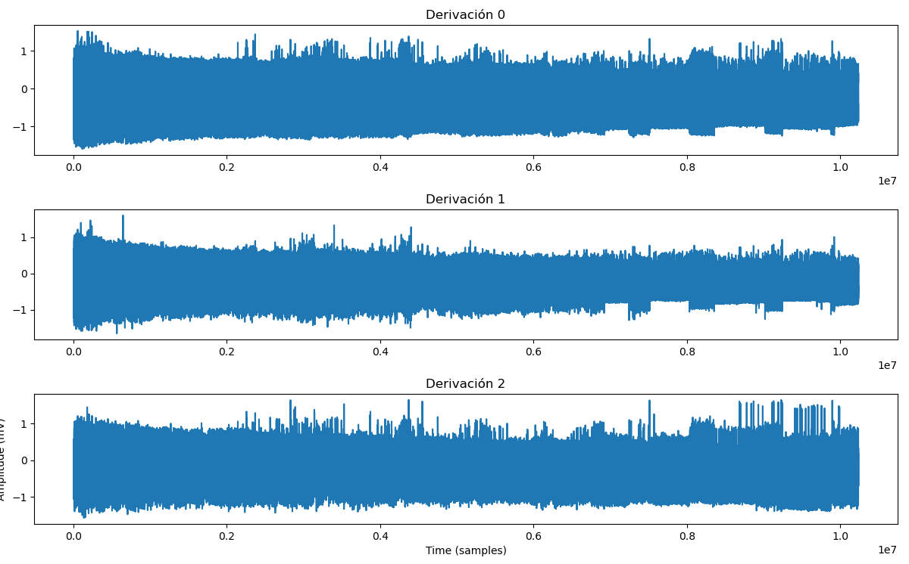
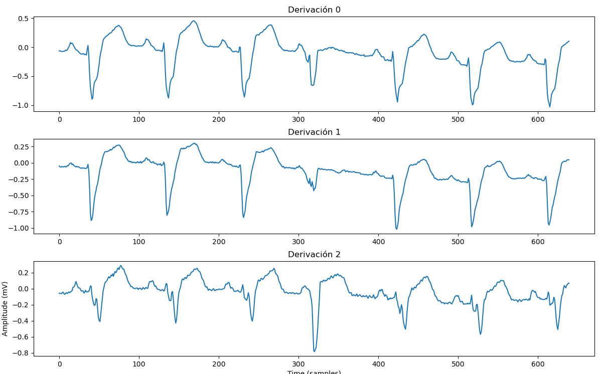
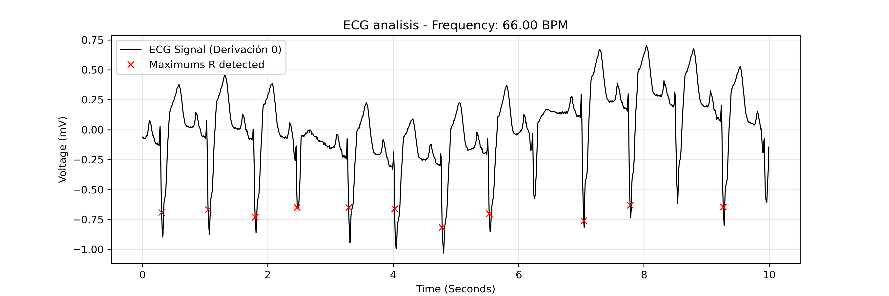

# ECG SIGNAL PROCESSING AND HEART RATE DETECTION - my first project

## Overview

This project focuses on the processing and analysis of electrocardiogram (ECG) data. Using the MIT-BIH Long-Term ECG Database, the program developed in Python extracts raw cardiac signals and calculates heart rate (BPM) through an adaptive peak-detection algorithm. The aim was learning and having a bit of contact with biomedical engineering role.

## Project structure

To maintain a clean and organized workflow, the project has been divided into the following directories:

**data** is the folder which contain all data files extracted from PhysioNet, 15814.dat and 15814.hea. These files are not included due to their large size.

All processing pipeline is in **scripts** folder. The folder contain four scripts: 
   -  `01_load_and_export.py`
   -  `02_segmentation.py`
   -  `02_segmentation_correction.py`
   -  `03_peak_detection.py`

And finally all analysis results are located in **Results**.
Configuration files like `.gitignore` have been added to avoid all Non-essential assets.

## Tools and technologies

Electrocardiogram data from database is not legible by python, then it must be read through specific tools. Python libraries have been used to extract all data and developing all signals and information useful for nurses and doctors. Used python libraries are `wfdb`, `numpy`, `matplotlib` and `pandas`.

**wfdb** is the Python library capable of parsing ECG-data into a Record object. Each attribute represent specific parameter from ECG. 

**Matplotlib** gives the plots from the ECG with all data which have been extracted by wfdb python library.

**Pandas** uses ECG-data to export the processed data into a structured CSV format.

**Numpy** was used for numerical computing and implementing the statistical logic of the peak-detection algorithm.

## Technical methodology

Every file from **scripts** has an specific role:

`01_load_and_export.py` handles the data ingestion. `wfdb` decodes ECG-data with function **wf.rdrecord()** creating an object (record) whose attributes are used by matplotlib library to generate the signall plots.

One of the main attributes is a matrix represented by 'signals' variable whose columns represent each lead and whose rows represent each voltage per sample.'sampling_frequency' is the number of samples in one second. ECG measures voltage per sample, not voltage over time.

 In this file plots show three leads used in the ECG. The leads represent the signal captured by each electrode used to capture the instantaneous voltage at a specific point in time. 

 

Finally with `pandas` library, signals is converted into CSV format which can not be included due to its large size. 
This script also prints the frequency and the samples number from ECG.

`02_segemntation.py` script is responsible for generating a time window. ECG-signal has a vast amount of data, therefore, five seconds has been visualized to isolate the sample from first lead.

You can note that there are two 02_segmentation scripts, this is due to when the five seconds from first lead are plotted, inverted polarity is observed. Thus the signals must be edited and `02_segmentation_correction` shows the correct time windowing and the detected peaks.

'Signals' variable is used to generate the plot and 'signal' represents the inverted polarity to find the peaks. Peaks are detected by using numpy library. Threshold variable is the limit which 'peaks' must surpass nevertheless a heartbeat is not a specific point but it is a "wave" of samples surpassing the limit. Then 'real_peaks' variable collects the real heartbeats detected by checking if at least 0.5 seconds (approximately 64 samples at 128Hz) have passed since the last.

Finally the original segmentation prints each point which is higher than threshold (35) and the fixed segmentation prints the heartbeats' real number (6).

(This image was created before second script with another code which was delezted. You can use 'for loop' to create the plot in second script with matplotlib library.)

`03_peak_detection.py` script focuses on peak detection and generating an isolated plot of the first ten seconds. This is final step of the pipeline. 

'signal' variable is inverted again due to inverted polarity and time vector is created to create the function 'voltage over time'.

The Adaptive Threshold is a limit calculated using the signal's mean and standard deviation using numpy library, allowing the algorithm to automatically adjust to different heart morphologies and noise levels. Similarly to the second script, the peaks must surpass the limit and the same way an array is generated to be visualized into a plot. 

The beats per minute (BPM) is calculated dividing the number of peaks out of total time.

Finally BPM is printed and plot is generated and saved with 'os' library.

The algorithm successfully detected a logic heart rate  of *66 BPM* for this specific record.   

To sum up, the project consisted of learning how wfdb, matplotlib, pandas and numpy work. In addition to the tools, the most important learning points were:

- Understanding that ECG is a sequence of discrete voltage samples.

- Identifying and correcting the inverted polarity.

- Developing an adaptive thresholding logic that moves from a manual limit to a dynamic statistical model that can adapt to different heart morphologies.

- Learning how to translate biomedical signals into clinical metrics like BPM.

